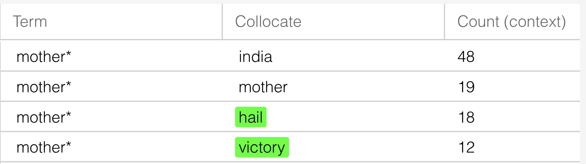
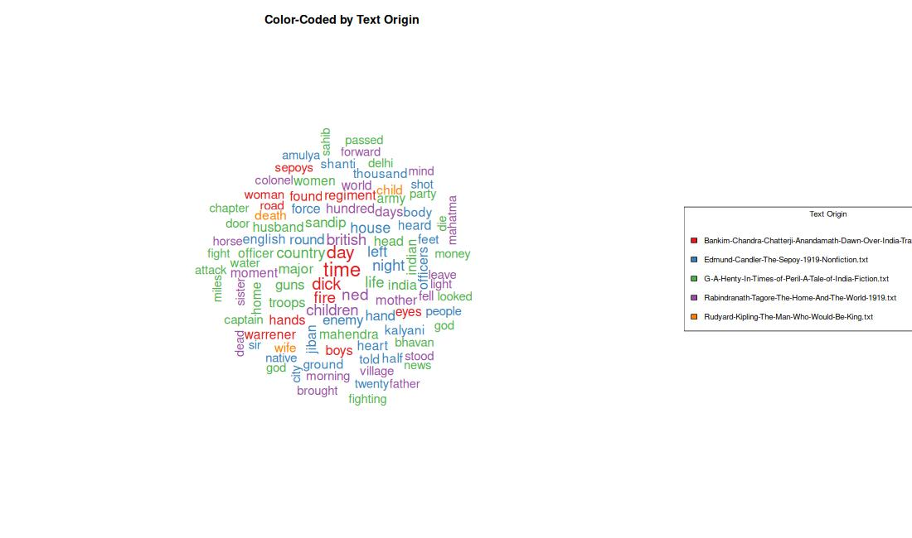
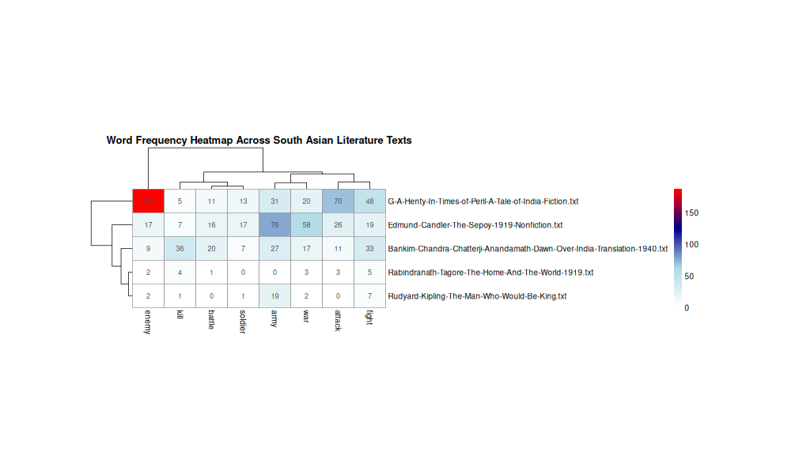

In my twenty years of living, I have never read a book that falls into the category of Post-Colonial South Asian literature. The question of how (or whether) I could ever read all of PCSA literature was humorously answered by Emily Temple in her blog “How Many Books Will You Read Before You Die?”: “You won’t.”.  For that reason, working with such a corpus presented a valuable opportunity to analyze texts I would not otherwise encounter through the method of distant reading.

To ensure we are on the same page, distant reading can be defined, as explained by Ama Bemma Adwetewa-Badu during her discussion with Kim Adams and Saronik Bosu on the podcast *High Theory*, as the development of critical insight by aggregating a large body of texts rather than relying solely on close reading of a limited canon. This method enables large-scale examinations of literary history by identifying patterns, themes, and structures that may not be visible through traditional reading alone.

In simpler terms, distant reading involves using computational tools to analyze large collections of literary works. Because reading the entirety of Post-Colonial South Asian literature would take years, and not to mention beginning comparative analysis of the text itself , this approach allows for a broader perspective within a manageable scope.
For this project, I selected five texts from the larger corpus that illuminate how post-colonial society and colonial power relations are represented. Three of these works were written by British authors, representing the perspective of imperial power, while two were written by South Asian authors, representing those positioned as the colonized “other.” This contrast provides a framework for examining how authority, identity, and resistance are constructed across different viewpoints.

Before applying distant reading tools such as **Voyant** and **RMarkdown**, it was necessary to conduct background research on the authors and historical contexts of these works. This broader perspective helps clarify what patterns to look for in the analysis and how each text reflects the cultural and political tensions of its time. I collected multiple links from Wikipedia and Britannica and runned it through ChatGPT to create a brief bulletpoint of each Author and their work as mentioned below:

**Power (British authors)**:
- **In Times of Peril: A Tale of India by G. A. Henty**.  Published in 1881, this centers on the Indian Rebellion of 1857. Following Henty's usual formula, it places young British characters amid violence and siege warfare, exemplifying Victorian imperialist literature meant to inspire patriotism and courage in British youth.

- **The Sepoy by Edmund Candler — Published in 1919**.  this draws on Candler's firsthand experiences as a World War I correspondent. It examines the Indian soldiers who fought for the British Empire, portraying the complex — often paternalistic yet admiring — relationship between British observers and the Indian Army.

- **The Man Who Would Be King by Rudyard Kipling**. Published in 1888, this short story follows two rogue ex-soldiers who travel to remote Kafiristan to rule as self-made kings. A tragicomic exploration of imperial ambition, arrogance, and its ultimate fragility.

**Other (South Asian authors)**:
- **Anandamath by Bankim Chandra Chatterji**.  First published in 1882, this landmark of Indian literature is set during the Bengal Famine of 1770 and the Sannyasi Rebellion. It popularized the image of Mother India as a goddess and includes "Vande Mataram," which later became a rallying cry for the independence movement. (COOL!)

- **The Home and the World by Rabindranath Tagore**.  Published in 1916, this novel is set during the Swadeshi movement. Through a love triangle, Tagore explores the dangers of fanatic nationalism and the tension between Western modernity and Indian tradition.

<figure>
  
  <figcaption>Figure 1: A Large Wordcloud of selected text</figcaption>
</figure>

By having this bird-eye view it helps set up what type of analysis we look for while using tools such as Voyant and RMarkdown in order to see proper visualizations of our distant readings. Through RM, it helped me create a huge word cloud filled with all common words for all the books to see what I have in my hands.

I simmered down the huge word cloud into a more compact one that contains common terms throughout all the texts to help ease the analysis for me.

<figure>
  
  <figcaption>Figure 1: Compact form of Previous Wordcloud</figcaption>
</figure>

**{Freedom}**

The first set of words that caught my attention were words directly related to the nation itself, such as 'India', 'British', and 'English'. The prominence of these words suggested that the idea of the nation was central across the texts. Seeing this made me think about what people usually associate most strongly with their nation, and the first idea that came to mind was 'freedom'. Because of this, I decided to examine how often the word 'freedom' appeared in each text. The results were surprising: there was a clear increase in the use of this word among the South Asian authors, while the English authors barely used it, and in some cases did not use it at all. This suggests that the idea of freedom was much more central to the writings of South Asian authors, reflecting their stronger engagement with questions of independence and political identity.
<iframe style='width: 1512px; height: 801px;' src='https://voyant-tools.org/tool/Trends/?view=Trends&stopList=keywords-91ef7e8d3b66f7fdbf704b7b05e518bc&query=mother*&query=india&query=english*&query=freedom*&mode=&corpus=d9af0425a000bf182d908f4a6ecd5b17'></iframe>

Another term that initially surprised me was 'mother'. At first, I assumed it was being used in a literal sense, referring to family or personal relationships. However, after looking more closely, especially alongside the search for 'freedom', I noticed that 'mother' often appeared together with words such as 'India', 'Hail', and 'Victory'. 

This pattern suggests that 'mother' was frequently used to describe India itself, reflecting the idea of “Mother India” rather than a biological mother. This interpretation is also supported by the overall trends: South Asian authors collectively used the word 'mother' even more frequently than the word 'India', while the English authors showed the opposite pattern and used 'India' far more often than 'mother'.

This almost opposite pattern reveals a clear difference in how India was conceptualized by each group of authors. For the South Asian writers, India appears to be represented in a more emotional and symbolic way, especially through the language of freedom and the image of a mother. The English authors, in contrast, tend to describe India in a more neutral and geographical manner, treating it primarily as a place rather than a symbolic homeland. This contrast highlights how the same nation could be understood and represented in fundamentally different ways depending on the perspective of the writer.

**{Leadership and Authority}**
I also wanted to test out a color coded (by the text) wordcloud from RMarkdown to see if there were any other patterns I could encounter.

Thanks to the color grouping of the cloud. A new set of words that stood out to me were words related to war and violence, such as war, battle, enemy, soldier, attack, kill, fight, and army. Because several of these texts take place during periods of conflict, I wanted to see how often military language appeared in each work. Using RMarkdown, I created a heatmap that shows the frequency of these words across the five texts.

The first thing that stood out was how much more frequently these words appeared in the British texts compared to the South Asian texts. In Times of Peril had especially high counts for words such as enemy, attack, and army, making it the most focused on direct fighting and combat. The Sepoy also showed consistently high numbers across many of the war-related words, including war, battle, and soldier. Seeing this pattern suggested that war and military action were central themes in the British narratives.

The South Asian texts showed a very different pattern. The Home and the World contained almost no military language at all, with only a few appearances of words like enemy or fight. This suggests that the conflict in Tagore’s novel is less about physical violence and more about political and social tension. Anandamath showed more military language than Tagore’s novel, especially with words such as kill and fight, but still far less than the British texts.
Another interesting pattern appears in the clustering on the left side of the heatmap. The British war stories appear close together, while the South Asian texts appear grouped separately with much lower frequencies. This suggests that the texts naturally separate into two groups based on how much they focus on war and violence.

This pattern connects to what was already seen in the analysis of freedom and national symbolism. While the South Asian authors focused more on ideas like freedom and the image of Mother India, the British authors focused much more on war and military action. This suggests that British writers often described India as a place of conflict and imperial struggle, while South Asian writers were more concerned with national identity and social change.

<iframe style='width: 757px; height: 438px;' src='https://voyant-tools.org/tool/Bubblelines/?query=army&query=war*&query=war&query=freedom*&query=mother*&docId=7f859a22f0d843d66971a9b3203dd59f&docId=0ddf4a2827bd67d65ac94ba141363614&docId=95b1043ba90fee9c7f5b729a75ccf096&docId=b445e31a2dee4af8b90b0574d95c9578&docId=9a4ffeec107d1a278d99230e7ebbb794&corpus=7cab4bde4fed17e6a9f959e21e034311'></iframe>

**{Final Thoughts:}**
Distant reading revealed patterns impossible to detect through traditional reading alone. Across five texts, we viewed how British authors emphasized military conflict, strategy, and imperial authority, portraying India as a stage for adventure and control, just like how a colonial would think of any land. While  South Asian authors focused on freedom, identity, and emotional symbolism, portraying India as a living, sacred entity embodied in “Mother India.”

These contrasting patterns that helped come to life with clear visualization show how perspective shapes narrative. The same historical moments are seen as battles and control (Power) or struggles for selfhood and yearning for cultural survival (Other). 

But it's worth being honest about the limitations of this approach, Underwood in his book *Distant Horizon* cautions against what he calls "the risk of preoccupation with technology",  the temptation to treat computational tools as inherently objective or impressive, rather than as instruments that encode human choices and assumptions. Every decision I made in this project,  which texts to include, which words to track, how to interpret a word cloud. We're all  a subjective and  interpretive act. The heatmap and word frequencies didn't tell me what to think. They gave me a new angle from which to think.

Perhaps most importantly, distant reading here worked best not as a replacement for close reading, but as a complement to it. The word 'mother' appearing at high frequency was meaningless on its own at the start with the huge word cloud. It only became significant when I read it alongside 'India', 'Hail', and 'Victory'. and remembered the mention of ‘Vande Mataram’ which led me to search for the poem later on, in which I understood the significant cultural significance it has on India . The pattern opened the question; the reading answered it.

In the end, even if distant reading is a powerful tool for acquiring knowledge of texts at scale, it thrives in combination with the traditional ways.  Curiosity, historical context, and the willingness to actually sit with the words on the page.
